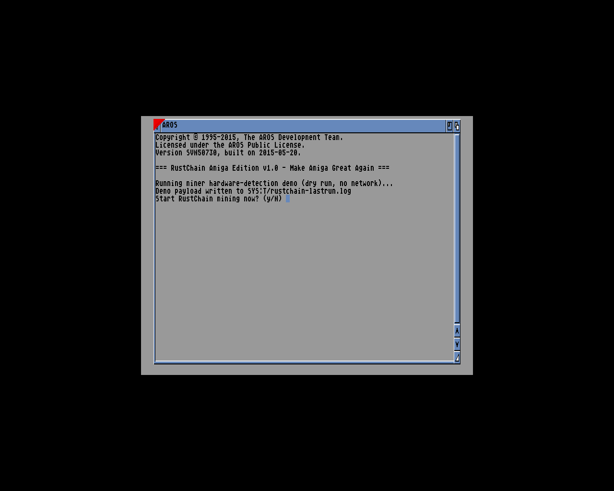
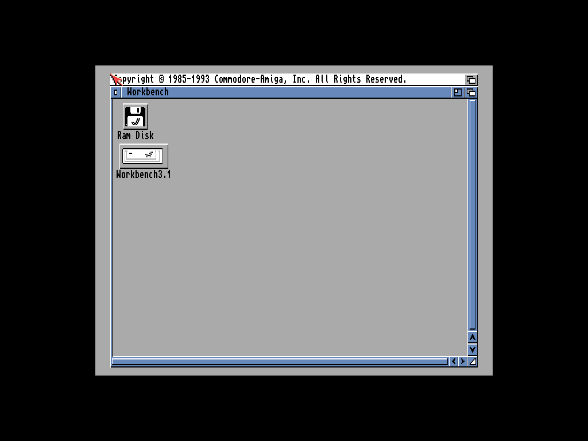
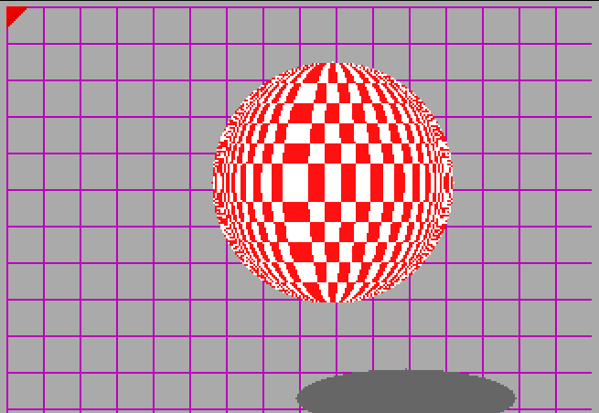

# RustChain Amiga Edition

RustChain, running on a classic Amiga. Real m68k code, live-attested against the
production RustChain network from inside FS-UAE, honest about being emulated, and
packaged as a bootable distribution anyone can try for free.

Make Amiga great again.

## Screenshots

The public distribution booting on the open-source AROS ROM, showing the
hardware-detection demo and the ask-before-mining prompt (default no):



The personal tier: Workbench 3.1 on a genuine, license-decrypted Kickstart 3.1
ROM (Amiga Forever). This image is built locally and never redistributed.



Claude Code's tool-use loop, running on that same real Workbench 3.1 / real
Kickstart 3.1. Claude answers over the proxy, then writes a file on the Amiga's
own volume through its `write_file` tool. See `claude/`.


And because no Amiga repo is complete without it, the Boing Ball, rendered by
native m68k code (`boing/`):



## What is in here

| Dir | What it is |
|-----|------------|
| `miner/` | The RustChain miner as a single-file C program for classic AmigaOS. Detects the CPU via ExecBase AttnFlags, hashes the Kickstart ROM, runs hardware fingerprint checks, and attests over bsdsocket.library. Self-detects UAE and reports it honestly. |
| `sdk/` | librustchain, the RustChain SDK for AmigaOS development. Six headers, a static lib, two examples. A full attestation is about 12 calls. |
| `tools/` | rtcwallet (balance and epoch), rtcfetch (HTTP fetch), rtctop (network status table). All AmigaShell CLI tools. |
| `ports/` | amiports, a MacPorts-style package manager. Portfile recipes, a host build harness, and an on-Amiga `amiport install` client that fetches, SHA-1 verifies, and extracts packages over HTTP. |
| `java/` | mjvm, a micro-JVM in ANSI C that runs javac-produced class files on AmigaOS. Plus an evidence-backed feasibility report on why GCJ was a dead end. |
| `claude/` | Claude on the Amiga: a native C client for the Anthropic Messages API with a real tool-use loop. Chats, and reads/writes files and runs AmigaDOS commands on the Amiga at Claude's instruction, behind a confirm gate. AmiSSL direct HTTPS or a host proxy. Runs on real Workbench 3.1 and AROS m68k. See `claude/README.md`. |
| `boing/` | The Boing Ball as native m68k code. Custom screen, purple grid, curved-checker sphere, shadow. graphics.library plus intuition.library. Because obviously. |
| `distro/` | The distribution pipeline. Builds a bootable public HDF on the open-source AROS ROM, a rustchain-tools.lha pack for stock Workbench, and a personal Workbench 3.1 variant for people who own the real thing. |
| `emu/` | FS-UAE environment: configs, AROS ROM hashes, boot evidence. |
| `docs/` | The AmigaOS upgrade path: 3.2.3 classic, 4.1 Final Edition under QEMU, AROS for free. |
| `server/` | Draft-only server patches: m68k antiquity multipliers and AROS ROM database entries. Not deployed. |

## Quick start (Linux host, no Amiga required)

```sh
sudo apt install fs-uae
git clone https://github.com/Scottcjn/rustchain-amiga
cd rustchain-amiga
fs-uae distro/configs/RustChainAmiga-public.fs-uae
```

That boots RustChain Amiga Edition on the AROS ROM (open source, included).
The miner runs a dry-run demo at boot and asks before mining. Default is no.

To rebuild everything from source you need Docker. The cross-compiler is
`amigadev/crosstools:m68k-amigaos` (bebbo gcc 6.5). Each dir has a Makefile
and a README with exact commands.

## The honest-emulation story

RustChain uses Proof of Antiquity: old hardware earns more, and emulators are
supposed to be caught. This port leans into that instead of fighting it. The
miner checks for `uae.resource` and tells the server the truth. An emulated
Amiga gets accepted, flagged, and earns roughly nothing. A real Amiga reports
clean and earns the real multiplier. If you want the rewards, drag the A1200
out of the attic.

## What runs on the Amiga side

- The miner and all three tools, built as AmigaOS hunk executables, 68000 baseline
- amiport, installing packages over the network from inside the emulator
- Java bytecode, via mjvm (int, String, int[] subset, real Java semantics)
- Everything works on the free AROS ROM. Nothing here requires a Kickstart.

## m68k porting notes we paid for in blood

- bebbo gcc 6.5 miscompiles 64-bit shifts at -m68000. Use shift-free algorithms
  for anything in the trust path. Our isqrt64 is a binary search on purpose.
- libnix printf has no %lld. Print 64-bit values with your own helper.
- It is ILP32. Test on a 32-bit host build (we use an i386 Docker container)
  or these bugs hide until they reach real silicon.
- The AmigaDOS shell escape character inside quotes is `*`. Your ASCII art
  banner will find this out for you.

Full list in `sdk/docs/QUICKSTART.md`.

## Licensing

Code here is MIT unless a dir says otherwise. The AROS ROM is APL (open
source). Kickstart ROMs, Workbench, and Amiga Forever content are NOT included
and never will be. If you own them, `distro/personal/` shows how to build your
own Workbench 3.1 image locally. Buy AmigaOS 3.2 from Hyperion or Amiga Forever
from Cloanto; `docs/AMIGAOS_UPGRADE_PATH.md` has the details.

## Status

Live-attested against the production network. The miner, SDK, tools, package
manager, and public distro image all have in-emulator test evidence checked in.
vbcc devkit and MicroPython ports are in progress.
