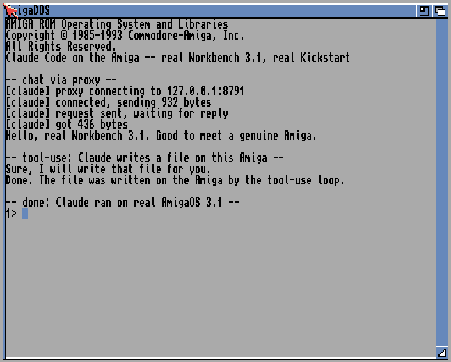
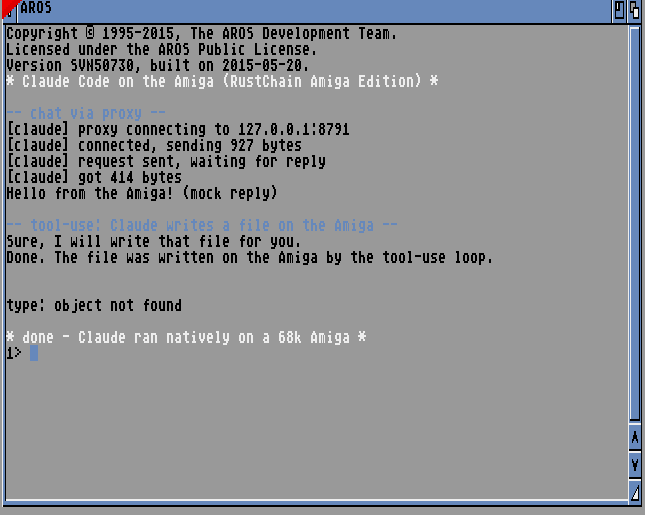

# Claude on the Amiga

A native C client for the Anthropic Messages API for classic AmigaOS (m68k)
and AROS, with a real tool-use loop. This is "Claude Code, non-Node" for the
Amiga: a small chat client that can also read and write files and run commands
on the Amiga's own filesystem, at Claude's instruction, behind a confirmation
gate.

## It runs

On real Workbench 3.1 with a genuine Commodore Kickstart 3.1 ROM (Amiga
Forever), booted in FS-UAE. Claude answers over the proxy, then writes a file
on the Amiga's own volume through the `write_file` tool. The banner is the real
Kickstart ("Copyright (c) 1985-1993 Commodore-Amiga, Inc."), not AROS:



It also runs on the open-source AROS m68k ROM (what the automated test uses,
since AROS is redistributable and real Kickstart ROMs are not):



## Proof the tooling works with a real model

`proof/` has two reproduced runs where Haiku 4.5 (reached through the proxy in
OpenRouter mode) drove the tool-use loop on real Workbench 3.1: one where it
scaffolded a `hello.c` and `Makefile` with `write_file`, and one where it used
`run_command version` / `avail` to work out it was on a Commodore Amiga running
AmigaOS 3.1 and commented on the anachronism. The exact files it wrote, the
screenshots, and a redacted proxy log are checked in. See `proof/README.md`.

(`type: object not found` is only because `type` is not in the bare AROS ROM
shell. The file was written; the tool-use loop reported it, and the file is
there on the volume.)

## Prior art and what is actually new here

Being accurate about "first": a native Amiga app already talks to Claude.
[AmigaGPT](https://github.com/sacredbanana/AmigaGPT) is a multi-provider AI
client for AmigaOS 3.x/4.1/MorphOS that supports Anthropic Claude for **chat**.
So this is **not** the first native Claude client on the Amiga.

What is new here, as far as any public prior art we could find: an **agentic
tool-use loop** on a classic 68k Amiga, where Claude decides to call
`read_file` / `write_file` / `run_command` and the Amiga executes those against
its own filesystem and AmigaDOS shell, then feeds the results back. That is the
"Claude Code" behaviour (an agent acting on the machine), not just chat. We
have not found another public example of a tool-calling LLM manipulating a 68k
Amiga. We are not claiming an absolute first; we are saying we could not find
prior art for this specific thing.

## Honest scope (what this is and is not)

- This is **not** the Node/TypeScript Claude Code app. That does not run on a
  68k. This is a from-scratch C client that speaks the same HTTP API.
- It talks to the real Anthropic Messages API: `POST /v1/messages`, model
  default `claude-opus-4-8`, `anthropic-version: 2023-06-01`.
- It has two transports:
  1. **AmiSSL direct HTTPS (primary, self-contained).** The Amiga does the TLS
     itself with AmiSSL and talks straight to `api.anthropic.com`. The API key
     lives on the Amiga (`ENV:ANTHROPIC_API_KEY` or `SYS:.claude/config`).
  2. **Host proxy (fallback).** For a machine with no TLS library (a bare-ROM
     AROS boot), `claude --proxy host:port` sends plain HTTP to a small Python
     bridge on another box that does the TLS and holds the key. In this mode
     **the key never touches the Amiga.**
- The tool-use loop runs **on the Amiga**: Claude asks to read/write a file or
  run a command, and the Amiga client executes it locally and sends the result
  back. Write and run are gated behind a `y/N` prompt.

## Layout

```
claude/
  README.md                 this file
  proxy/
    claude_amiga_proxy.py    host-side TLS/key bridge (fallback transport)
  client/
    claude.c                 the client (one file; C89, m68k rules)
    Makefile                 docker cross build + host self-test
    vendor/
      rtc_common.c/.h        vendored HTTP/JSON/SHA-1 helpers (from tools/common)
    bin/claude               built Amiga hunk executable (AmiSSL-linked)
  test/
    claude-test.fs-uae       FS-UAE config (AROS m68k, bsdsocket)
    mock_proxy.py            canned Anthropic-shaped endpoint (no key needed)
    run_test.sh              boots headless, verifies chat + tool-use in guest
    shared/                  boot volume: the claude binary + S/startup-sequence
```

## Build

```
cd client
make host-test     # native + i386 ILP32 self-test of the JSON/message logic
make bin/claude    # Amiga hunk exe via docker (amigadev/crosstools) + AmiSSL
```

`make bin/claude` produces an AmigaOS hunk executable linked against the AmiSSL
SDK that ships in this repo (`python/src/amissl-sdk/`). `file bin/claude`
reports `AmigaOS loadseg()ble executable/binary`. The binary is built at
`-m68000` so it runs on any 68k; it needs a full AmigaOS/AROS with
`bsdsocket.library` (v4) and, for direct HTTPS, AmiSSL v5 installed.

## Run it for real (what Scott must provide: the API key)

### Option A - AmiSSL direct (recommended, self-contained)

On the Amiga (real hardware with AmiSSL + a TCP stack, or a full AROS install):

1. Put your key where the client can find it. Either:
   - `setenv ANTHROPIC_API_KEY sk-ant-...` (and `copy ENV:ANTHROPIC_API_KEY
     ENVARC:` to persist), or
   - create `SYS:.claude/config` with a line `ANTHROPIC_API_KEY=sk-ant-...`
2. Chat:
   ```
   claude "Explain what a Copper list does on the Amiga"
   claude -i                 ; interactive REPL, /quit to exit
   ```

The key never leaves the Amiga in this mode. TLS certificates are verified
against AmiSSL's CA bundle by default; if your AmiSSL install has no CA bundle
you will get a verify error - install one, or use `--insecure` (documented,
not recommended) to skip verification.

### Option B - host proxy (for a machine with no TLS)

On a host that can reach the internet (Linux/Mac on the LAN or Tailscale):

```
export ANTHROPIC_API_KEY=sk-ant-...
python3 claude/proxy/claude_amiga_proxy.py           # listens on 0.0.0.0:8790
python3 claude/proxy/claude_amiga_proxy.py --selftest # one real round-trip
```

On the Amiga:

```
claude "Say hello" --proxy 192.168.0.50:8790
```

The proxy holds the key and does the TLS. It has an IP allowlist (LAN +
Tailscale), a simple per-IP rate limit, and audit logging to stderr. The key
is never sent to the Amiga.

## The tool-use loop (the "Claude Code" part)

The client offers Claude three tools:

| tool | what it does | gate |
|------|--------------|------|
| `read_file(path)` | Open/Read an AmigaDOS file | none (read-only) |
| `write_file(path, text)` | Open MODE_NEWFILE/Write | `y/N` prompt |
| `run_command(cmd)` | Execute() a shell command, capture output | `y/N` prompt |

When Claude replies with `stop_reason: tool_use`, the client runs each
requested tool locally, sends the results back as `tool_result` blocks, and
loops until `stop_reason: end_turn` (capped at 8 iterations). Destructive tools
prompt first:

```
Claude wants to write file: SYS:notes.txt. Allow? (y/N)
```

Default is No. `--yes` auto-approves for scripted/non-interactive use (this is
what the in-guest test uses, since a headless boot has no interactive stdin).

## Options

```
claude "prompt"          one-shot
claude -i                REPL (/quit to exit)
  --proxy host:port      use the plain-HTTP host proxy instead of AmiSSL
  --model NAME           default claude-opus-4-8
  --max-tokens N         default 4096
  --yes                  auto-approve write/run tools
  --insecure             skip TLS certificate verification (AmiSSL mode)
  --no-tools             disable the tool-use loop (plain chat only)
  -h, --help
```

## In-guest test (proof, no API key needed)

```
cd test
./run_test.sh
```

This starts a mock proxy that returns canned Anthropic-shaped replies (a plain
hello, and a `tool_use -> end_turn` sequence), boots AROS m68k headless in
FS-UAE, and checks that:

1. the guest's `SYS:claude.log` contains the chat reply, and
2. the tool-use loop wrote `SYS:claude_tool_out.txt` in `shared/`.

See `test/EVIDENCE.md` for a captured run.

## Notes on the C (m68k rules)

- One file, C89-friendly: declarations first, no `//` comments, no C99 loop
  declarations. Big-endian, ILP32, no 64-bit shifts, no `%lld`.
- Buffers are static so the stack stays small (TLS is stack-hungry); the
  binary sets a 128 KB stack cookie.
- JSON is handled with small dumb scans (same approach as the miner and
  `rtc_common.c`): `find_key` matches a `"key"` only when it is followed by a
  colon, so a value like `"type":"text"` does not shadow the real `"text"`
  key. String values are properly unescaped (`\n \r \t \" \\ \/ \uXXXX`).
- The AmiSSL init sequence follows the SDK example `https.c` (OS3/m68k path):
  open `utility.library`, `bsdsocket.library` v4, `amisslmaster.library`,
  `InitAmiSSLMaster`, `OpenAmiSSL`, `InitAmiSSL`, then `SSL_CTX_new` /
  `SSL_new` / `SSL_connect` / `SSL_write` / `SSL_read` over the socket fd.

## Security posture

- Proxy mode: key stays host-side, IP allowlist, rate limit, audit log.
- AmiSSL mode: key stays on the Amiga, TLS verified by default.
- Destructive tools gated `y/N`, default No.
- Nothing here touches the production RustChain nodes.

## Testing with OpenRouter (cheap, no Anthropic key needed)

The host proxy can route through OpenRouter so you can exercise the full client
protocol against a cheap real model (Haiku or Sonnet) without an Anthropic key.
The proxy translates Anthropic Messages <-> OpenAI chat/completions in both
directions, including the tool-use round trip, so the Amiga client is unchanged.

    export OPENROUTER_API_KEY=sk-or-...            # your OpenRouter key
    export OPENROUTER_MODEL=anthropic/claude-haiku-4.5   # or anthropic/claude-sonnet-4.5
    python3 proxy/claude_amiga_proxy.py --selftest      # one real round-trip
    python3 proxy/claude_amiga_proxy.py --bind 0.0.0.0 --port 8790   # serve the Amiga

Then on the Amiga: `claude "your prompt" --proxy <host>:8790`. The key stays on
the host; the Amiga never sees it. Verified working end to end (chat + tool-use)
against anthropic/claude-haiku-4.5 via OpenRouter.
