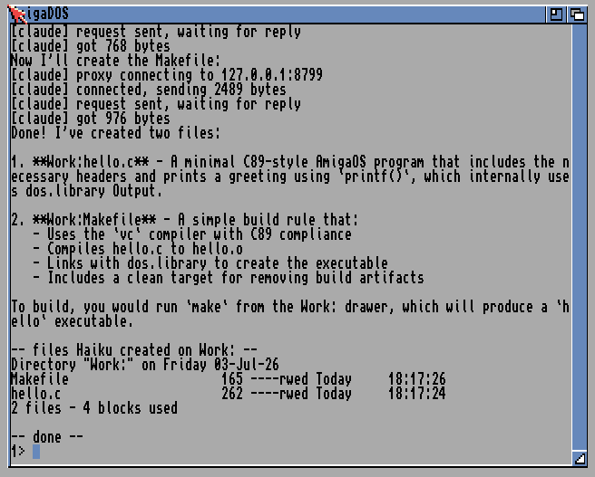
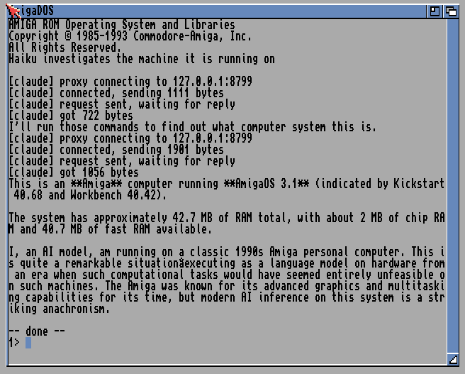
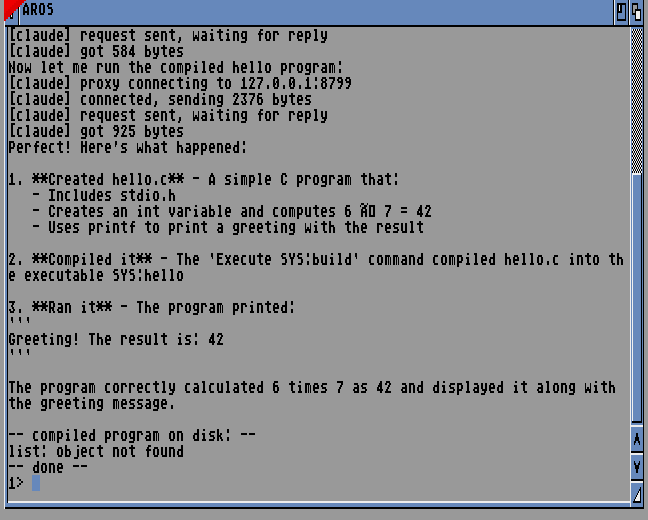

# Proof: a model using the tool-use loop on a real Amiga

These are reproduced runs of `claude/` (the native Anthropic client) driving its
tool-use loop on **real Workbench 3.1** with a **genuine Commodore Kickstart 3.1
ROM**, in FS-UAE. The model was **Haiku 4.5**, reached through the host proxy in
its OpenRouter mode (`OPENROUTER_MODEL=anthropic/claude-haiku-4.5`), to keep the
cost near zero. The Amiga client is unchanged; it just talks plain HTTP to the
host proxy, and the proxy does the TLS and holds the key.

Note on the model name in the proxy log: the Amiga client sends its default model
id (`claude-opus-4-8`), and the proxy overrides it to the OpenRouter model. The
`backend=openrouter` lines in `proxy-forward-log.txt` are the actual calls, and
they went to Haiku 4.5.

## 1. Haiku scaffolds an Amiga program

Prompt: scaffold a minimal AmigaOS C hello-world program and a Makefile, writing
each file with the `write_file` tool to the `Work:` volume.

Haiku ran the tool-use loop (three round trips: request, tool_result, tool_result)
and created two files on the Amiga's own volume:

- `haiku-scaffold/hello.c` - the exact file Haiku wrote (verbatim, imperfect and
  all; Haiku is a small model, this is a real scaffold and not cleaned up).
- `haiku-scaffold/Makefile` - a `vc`/C89 build rule with a `clean` target.



## 2. Haiku investigates the machine and comments

Prompt: you do not know what computer you are on; investigate with tools, then say
what it is and comment on running on it. Haiku called `run_command version` and
`run_command avail`, read the output back through the tool loop, and reported that
it was running on a Commodore Amiga / AmigaOS.



A practical note found while making this: AmigaDOS has a command-line length
limit, so the prompt passed on one `claude "..."` line must stay short (a long
prompt gives `Command too long`). The prompt above is deliberately terse.

## 3. Haiku scaffolds, compiles, and runs a program (the full loop)

The capstone. Prompt: write a small C program, compile it, run it, report the
output. Haiku wrote `haiku-compile/hello.c` (`int result = 6 * 7; printf(...)`)
with `write_file`, compiled it with `run_command Execute SYS:build` (which drives
the vbcc pipeline on the Amiga from `devkit/`), ran the result with `run_command
SYS:hello`, and reported back:

> Ran it - The program printed: `Greeting! The result is: 42`. The program
> correctly calculated 6 times 7 as 42.

So the agent wrote source, invoked a real native compiler, produced a real m68k
binary, executed it, and read its output back through the tool loop. Scaffold to
build to run, on a 68k Amiga. This one is on the open-source AROS ROM, because
the vbcc devkit environment used for the build is set up for AROS.



(`list: object not found` at the end is only because `list` is not in this bare
AROS ROM shell; the compiled `SYS:hello` binary is on disk.)

## Reproduce

Host side (never commit the key):

```
OPENROUTER_API_KEY=sk-or-... OPENROUTER_MODEL=anthropic/claude-haiku-4.5 \
  python3 ../proxy/claude_amiga_proxy.py --bind 0.0.0.0 --port 8799
```

Amiga side (any AmigaOS with bsdsocket, e.g. FS-UAE with `bsdsocket_library = 1`):

```
claude "your prompt" --proxy 127.0.0.1:8799 --yes
```

The `--yes` auto-approves the write/run confirmation gate for a scripted run. In
normal use the gate prompts before any write or command.
